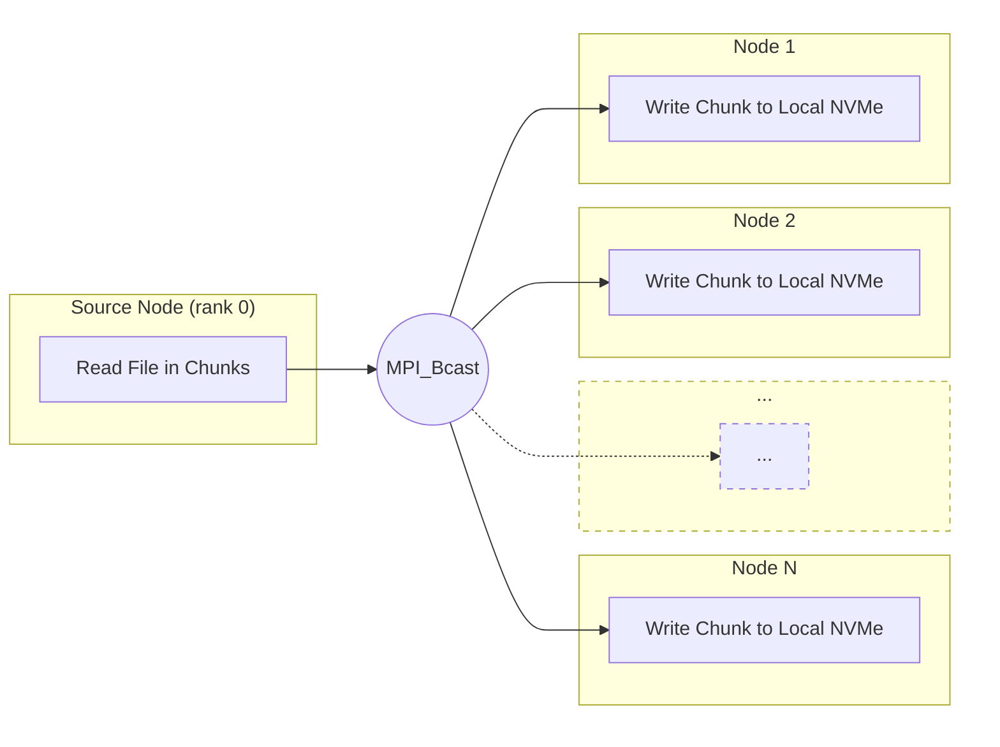

# mpi-stage: High-Performance File Distribution for HPC Clusters

*Efficiently staging large files across hundreds of nodes using MPI broadcasts*

---

When running containerized workloads on HPC clusters, one of the first problems you hit is getting container images onto the nodes quickly and repeatably. A `.sqsh` is a Squashfs image (commonly used by container runtimes on HPC). In some environments you *can* run a Squashfs image directly from shared storage, but at scale that often turns the shared filesystem into a hot spot.

Copying the image to local NVMe keeps startup time predictable and avoids hundreds of nodes hammering the same source during job launch.

In this post, I'll introduce [mpi-stage](https://github.com/edwardsp/mpi-stage), a lightweight tool that uses MPI broadcasts to distribute large files across cluster nodes at speeds that can saturate the backend network.

## The Problem: Staging Files at Scale

On an [Azure CycleCloud Workspace for Slurm](https://github.com/Azure/ai-infrastructure-on-azure/tree/main/infrastructure_references/azure_cyclecloud_workspace_for_slurm) cluster with [GB300](https://learn.microsoft.com/en-us/azure/virtual-machines/sizes/gpu-accelerated/nd-gb300-v6-series?tabs=sizebasic) GPU nodes, I needed to stage a large Squashfs container image from shared storage onto each node's local NVMe storage before launching training jobs.

At small scale you can often get away with ad-hoc copies, but once hundreds of nodes are all trying to read the same source file, the shared source filesystem quickly becomes the bottleneck.

I tried several approaches:

### Attempt 1: Slurm's sbcast

Slurm's built-in [sbcast](https://slurm.schedmd.com/sbcast.html) seemed like the natural choice. In my quick testing it was slower than I wanted, and the overwrite/skip-existing behavior didn't match the "fast no-op if already present" workflow I was after. I didn't spend much time exploring all the configuration options before moving on.

### Attempt 2: Shell Script Fan-Out

I wrote a shell script using a tree-based fan-out approach: copy to N nodes, then each of those copies to N more, and so on. This worked and scaled reasonably, but had some drawbacks:

1. **Multiple stages**: The script required orchestrating multiple rounds of copy commands, adding complexity
2. **Source filesystem stress**: Even with fan-out, the initial copies still hit the source filesystem simultaneously — a fan-out of 4 meant 4 nodes competing for source bandwidth
3. **Frontend network**: Copies went over the Ethernet network by default — I could have configured IPoIB, but that added more setup

### The Solution: MPI Broadcasts

The key insight was that MPI's broadcast primitive (`MPI_Bcast`) is specifically optimized for one-to-many data distribution. Modern MPI implementations like HPC-X use tree-based algorithms that efficiently utilize the high-bandwidth, low-latency InfiniBand network.

With [mpi-stage](https://github.com/edwardsp/mpi-stage):
- **Single source read**: Only one node reads from the source filesystem
- **Backend network utilization**: Data flows over InfiniBand using optimized MPI collectives
- **Intelligent skipping**: Nodes that already have the file (verified by size or checksum) skip the copy entirely

Combined, this keeps the shared source (NFS, Lustre, blobfuse, etc.) from being hammered by many concurrent readers while still taking full advantage of the backend fabric.

## How It Works

[mpi-stage](https://github.com/edwardsp/mpi-stage) is designed around a simple workflow:



The source node reads the file in chunks and streams each chunk via `MPI_Bcast`. Destination nodes write each chunk to local storage immediately upon receipt. This streaming approach means the entire file never needs to fit in memory — only a small buffer is required.

### Key Features

**1. Pre-copy Validation**

Before any data is transferred, each node checks if the destination file already exists and matches the source. You can choose between:

- **Size check** (default): Fast comparison of file sizes—sufficient for most use cases
- **Checksum**: Stronger validation, but requires reading the full file and is therefore slower

If all nodes already have the correct file, [mpi-stage](https://github.com/edwardsp/mpi-stage) completes in milliseconds with no data transfer.

**2. Double-Buffered Transfers**

The implementation uses double-buffered, chunked transfers to overlap network communication with disk I/O. While one buffer is being broadcast, the next chunk is being read from the source.

**3. Post-copy Validation**

Optionally verify that all nodes received the file correctly after the copy completes.

**4. Single-Writer Per Node**

The tool enforces one MPI rank per node to prevent filesystem contention and ensure predictable performance.

## Real-World Performance

In one run using 156 GPU nodes, distributing a container image achieved approximately **3 GB/s effective distribution rate (file_size/time)**, completing in just over 5 seconds:

```
[0] Copy required: yes
[0] Starting copy phase (source writes: yes)
[0] Copy complete, Bandwidth: 3007.14 MB/s
[0] Post-validation complete
[0] Timings (s):
  Topology check:    5.22463
  Source metadata:   -0.00803746
  Pre-validation:    -0.0046786
  Copy phase:        -5.21189
  Post-validation:   -2.2944e-05
  Total time:        5.2563
```

> Because every node writes the file to its own local NVMe, the *cumulative* write rate across the cluster is roughly this number times the node count: ~3 GB/s × 156 ≈ **~468 GB/s of total local writes**.


## Workflow: Container Image Distribution

The primary use case is distributing Squashfs images to local NVMe before launching containerized workloads. Run [mpi-stage](https://github.com/edwardsp/mpi-stage) as a job step before your main application:

```bash
#!/bin/bash
#SBATCH --job-name=my-training-job
#SBATCH --ntasks-per-node=1
#SBATCH --exclusive

# Stage the container image
srun --mpi=pmix ./mpi_stage \
    --source /shared/images/pytorch.sqsh \
    --dest /nvme/images/pytorch.sqsh \
    --pre-validate size \
    --verbose

# Run the actual job (from local NVMe - much faster!)
srun --container-image=/nvme/images/pytorch.sqsh ...
```

[mpi-stage](https://github.com/edwardsp/mpi-stage) will create the destination directory if it doesn't exist.

If your container runtime supports running the image directly from shared storage, you may not strictly need this step—but staging to local NVMe tends to be faster and more predictable at large scale.

Because of the pre-validation, you can include this step in every job script without penalty—if the image is already present, it completes in milliseconds.

## Getting Started

```bash
git clone https://github.com/edwardsp/mpi-stage.git
cd mpi-stage
make
```

For detailed usage and options, see the [README](https://github.com/edwardsp/mpi-stage).

## Summary

[mpi-stage](https://github.com/edwardsp/mpi-stage) started as a solution to a very specific problem—staging large container images efficiently across a large GPU cluster—but the same pattern may be useful in other scenarios where many nodes need the same large file.

By using MPI broadcasts, only a single node reads from the source filesystem, while data is distributed over the backend network using optimized collectives. In practice, this can significantly reduce load on shared filesystems and cloud-backed mounts, such as Azure Blob Storage accessed via [blobfuse2](https://github.com/Azure/azure-storage-fuse), where hundreds of concurrent readers can otherwise become a bottleneck.

While container images were the initial focus, this approach could also be applied to staging training datasets, distributing model checkpoints or pretrained weights, or copying large binaries to local NVMe before a job starts. Anywhere that a “many nodes, same file” pattern exists is a potential fit.

If you're running large-scale containerized workloads on Azure HPC infrastructure, give it a try. If you use [mpi-stage](https://github.com/edwardsp/mpi-stage) in other workflows, I'd love to hear what worked (and what didn't). Feedback and contributions are welcome.

---

*Have questions or feedback? Leave a comment below or open an issue on [GitHub](https://github.com/edwardsp/mpi-stage).*
